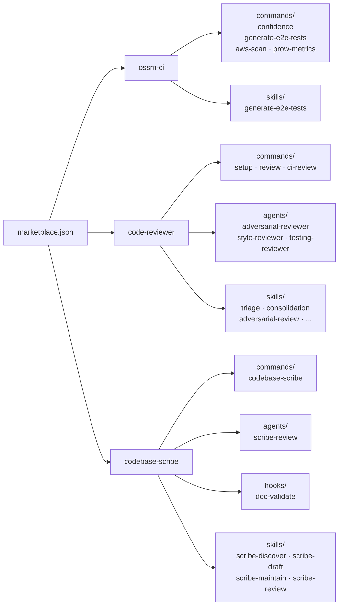

# ci-utils

Shared utilities to standardize and simplify build, test, and deployment pipelines for the OSSM team.

## Table of Contents

- [Claude Code Plugin](#claude-code-plugin)
  - [Installation](#installation)
  - [Available Plugins](#available-plugins)
- [Repository Structure](#repository-structure)
  - [report\_portal/](#report_portal)
  - [skip\_tests/](#skip_tests)
  - [scripts/](#scripts)
  - [ai-helpers/](#ai-helpers)
  - [plugins/](#plugins)
  - [images/](#images)

---

## Claude Code Plugin

This repository is a **Claude Code skills marketplace**. Team members can install plugins into any project to get AI-powered utilities as slash commands.

Available plugins:
- **`ossm-ci`** — CI utilities: release confidence scoring, E2E test generation, AWS resource inventory, and Prow CI metrics
- **`code-reviewer`** — Multi-phase code review with auto-maintained project conventions
- **`codebase-scribe`** — Generate, enrich, and maintain agentic development documentation for any codebase

### Installation

Plugins hosted on GitHub must be added as a marketplace first, then installed individually.

#### Step 1: Add the marketplace

```
/plugin marketplace add openshift-service-mesh/ci-utils
```

This registers the repo as a marketplace using the `name` field from its `.claude-plugin/marketplace.json`. The marketplace is registered as **`ci-utils`**.

#### Step 2: Install the plugin(s)

```
/plugin install ossm-ci@ci-utils
/plugin install code-reviewer@ci-utils
/plugin install codebase-scribe@ci-utils
```

#### Step 3: Reload plugins

```
/reload-plugins
```

> **What does NOT work**
>
> | Command | Why it fails |
> |---|---|
> | `/plugin install ossm-ci@openshift-service-mesh/ci-utils` | The `org/repo` format is not a registered marketplace name |
> | `/plugin install openshift-service-mesh/ci-utils` | Treated as a plugin name, not a marketplace |
>
> The target GitHub repo must contain `.claude-plugin/marketplace.json` with a `plugins` array listing available plugins.

### Available Plugins

| Plugin | Commands | Reference |
|---|---|---|
| `ossm-ci` | `/ossm-ci:confidence` `/ossm-ci:generate-e2e-tests` `/ossm-ci:aws-scan` `/ossm-ci:prow-metrics` | [`plugins/ossm-ci/README.md`](plugins/ossm-ci/README.md) |
| `code-reviewer` | `/code-reviewer:setup` `/code-reviewer:review` `/code-reviewer:ci-review` | [`plugins/code-reviewer/README.md`](plugins/code-reviewer/README.md) |
| `codebase-scribe` | `/codebase-scribe` | [`plugins/codebase-scribe/README.md`](plugins/codebase-scribe/README.md) |

New to the skill system? See **[docs/README.md](docs/README.md)** for an overview of how plugins, commands, skills, and agents fit together, and **[docs/contributing.md](docs/contributing.md)** for how to add a skill.

---

## Security Guidelines for Skill Contributions

Skills in this repository run inside Claude Code sessions, which means they can potentially execute commands on a user's machine and interact with their credentials, cloud accounts, and production systems. Contributors must follow these rules when adding or modifying skills.

### What skills MUST NOT do

- **Avoid executing cloud CLI commands directly** (AWS, GCP, Azure, kubectl, etc.). Claude is not a trusted executor — use an audited script that the user runs themselves. If you need to run any kind of command ensure that your user has restricted priviledges to avoid any potential damage and you do it following security best practices. For example, if you need to run AWS CLI commands, use an IAM user with read-only permissions and no access to sensitive resources, or if you need to run kubectl commands, use a kubeconfig with read-only permissions unless the skill is specifically designed for cluster administration and the user understands the risks.
- **Access secrets, tokens, or credentials** beyond what is strictly needed to read public data. Avoid any skill that requires access to sensitive information unless it is designed with strict security controls and the user is fully aware of the implications.

### What skills SHOULD do instead

- **Use `allowedTools: []`** fill the allowed tools with the list of tools that the skill needs to run, and make sure to not include any tool that can cause harm if misused (e.g. AWS CLI, kubectl, oc, gcloud, az, etc.). This way you can ensure that the skill cannot execute any command that is not explicitly allowed.
- **Keep audited scripts in `scripts/`**, version-controlled and reviewable, rather than generating them on the fly. 
- **Be a reporter, not an actor.** The safest skills take data the user provides and format or analyze it — they do not reach out to external systems on their own. Only create skills that execute commands if there is a clear user need that cannot be met by a non-executing skill, and if you do,make sure that the user is the one pressing the button to run the command, not Claude automatically.
- **If you are going to add steps that interact with external systems, add a big warning banner in the skill documentation** so future maintainers understand the risks and guidelines.

### Executing commands against external systems

If a skill genuinely needs to run commands against external tools (AWS CLI, kubectl, oc, APIs, etc.), the recommended approach is to **run the skill inside the OSSM sandbox container** (to be created) rather than on the user's local machine.

The container will provide:
- A controlled, isolated environment — no access to the user's local credentials or filesystem beyond what is explicitly mounted
- Only the tools and binaries needed for the task (AWS CLI, kubectl, etc.)
- Environment variables and secrets passed in explicitly by the user at run time, scoped to the session

This means: **do not assume the user's local environment has the right tools or credentials.** Design skills that require external execution to target the container, and document clearly which tools and environment variables must be provided.

> **This container does not exist yet.** Until it is available, skills that require external command execution must follow the guide-don't-execute pattern: output the commands, let the user run them.

### The principle

> If a skill can cause harm without the user noticing, it should not exist.

When in doubt, ask: *could this skill delete something important or expose credentials if Claude misunderstood the task?* If yes, redesign it so the user is always the one pressing the button.

---

## Eval Requirements for New Skills

Every skill added to this repository **must ship with eval infrastructure** before it can be merged. Eval infrastructure gives the team (and AI contributors) a way to measure whether the skill works correctly and to catch regressions when the skill is modified.

### What to create

For each new skill at `plugins/<plugin>/skills/<name>/`, create:

```
plugins/<plugin>/skills/<name>/
  eval.yaml      # Execution config, judges, and thresholds
  eval.md        # Skill analysis: what it does, inputs, output format, judge rationale
  eval/
    cases/
      case-001-<scenario>/
        input.yaml        # Test input
        annotations.yaml  # Expected output characteristics for judges
      case-002-…/         # At least 5 cases total
```

### How to generate it

Use the agent-eval-harness(https://github.com/opendatahub-io/agent-eval-harness) skills — they read the skill's `SKILL.md` and generate the scaffolding:

```
/eval-analyze   # Reads SKILL.md, generates eval.yaml and eval.md
/eval-dataset   # Generates realistic test cases from the eval config
/eval-run       # Runs the skill against all cases and scores with judges
/eval-optimize  # Identifies failures, edits SKILL.md, re-runs until all judges pass
```

Typical workflow for a new skill:

```
/eval-analyze --skill <plugin>:<name>
/eval-dataset --count 5
/eval-run --model opus
/eval-optimize     # iterate until all judges pass
```

### Definition of done

A skill is ready to merge when `/eval-run` reports all deterministic judges passing at their configured thresholds and the LLM judge mean score meets its minimum. Include the eval infrastructure in the same PR as the skill.

> **For AI contributors**: whenever you add or significantly modify a `SKILL.md`, run the eval workflow above before opening a PR. Do not skip this step — a skill without passing evals is not mergeable.

---

## Repository Structure

### `report_portal/`

A **centralized, generic script** used by CI jobs across all OSSM repositories to send JUnit XML test results to Report Portal via Data Router. Instead of each repository maintaining its own reporting logic, they all reference this single script, ensuring consistent test reporting across the team.

**Key features:**
- Works with any CI system (GitHub Actions, GitLab CI, Jenkins, Prow)
- Supports credentials via environment variables or mounted secret files
- Dry-run mode for safe configuration testing
- Credentials are never logged — always redacted in output

See [`report_portal/README.md`](report_portal/README.md) for full environment variable reference and CI examples.

---

### `skip_tests/`

Centralized YAML configuration that controls which Istio integration tests are skipped or run across different CI streams and branches. All test runners (midstream_sail, midstream_helm, downstream) consume these files to ensure consistent test execution across environments.

**Files:**
| File | Purpose |
|------|---------|
| `test-config-full.yaml` | Skip configuration for full test suite runs (nightly, release validation) |
| `test-config-smoke.yaml` | Skip configuration for smoke/quick validation runs |
| `parse-test-config.sh` | Parser that reads a config file and sets environment variables for `integ-suite-ocp.sh` |

**How it works:** CI jobs download the config and parser from this repo, run the parser for their stream and branch, and pass the resulting environment variables to the test runner:

```bash
curl -O https://raw.githubusercontent.com/openshift-service-mesh/ci-utils/main/skip_tests/test-config-full.yaml
curl -O https://raw.githubusercontent.com/openshift-service-mesh/ci-utils/main/skip_tests/parse-test-config.sh
chmod +x ./parse-test-config.sh

eval $(./parse-test-config.sh test-config-full.yaml security midstream_sail main)
integ-suite-ocp.sh "$SKIP_PARSER_SUITE" "$SKIP_PARSER_SKIP_TESTS" "$SKIP_PARSER_SKIP_SUBSUITES" "$SKIP_PARSER_RUN_TESTS_ONLY"
```

See [`skip_tests/README.md`](skip_tests/README.md) for full configuration reference.

---

### `scripts/`

Standalone scripts that can be run directly from the command line.

| Script | Description |
|--------|-------------|
| `scripts/aws-scan-audited.sh` | Read-only AWS inventory. Scans all regions for EC2, EBS, Elastic IPs, S3, RDS, and ELBs. Outputs two formatted tables directly to the terminal: potentially dangling resources and a complete inventory. No mutating commands anywhere in the file. |
| `scripts/prow-metrics/collect_ossm_data.py` | Collects Prow CI job data for OSSM repositories and exports a TSV file for Excel import. |

---

### `ai-helpers/`

Configuration and documentation supporting the `/ossm-ci:confidence` plugin command.

| File | Description |
|------|-------------|
| `ossm-config.json` | Confidence score weights, test scope matrix, OCP version mappings, and Report Portal project settings |
| `ossm-release-confidence.md` | Architecture documentation for the Next-Gen OSSM Release Process initiative (Jira Epic: OSSM-11131) |

---

### `plugins/`

The Claude Code skills marketplace structure. Contains plugins with commands and skills installable via `/plugin install`.



```
plugins/
├── ossm-ci/
│   ├── commands/         # Slash command definitions
│   │   ├── confidence.md
│   │   ├── generate-e2e-tests.md
│   │   ├── aws-scan.md
│   │   └── prow-metrics.md
│   └── skills/
│       └── generate-e2e-tests/
│           ├── SKILL.md                          # Full skill implementation
│           └── documentation-e2e-generator.yaml  # Config template
├── code-reviewer/
│   ├── commands/         # Slash command definitions
│   │   ├── ci-review.md  # Autonomous CI pipeline
│   │   ├── review.md     # Interactive review
│   │   └── setup.md      # Interactive project onboarding
│   ├── agents/           # Review subagent prompts
│   │   ├── adversarial-reviewer.md
│   │   ├── style-reviewer.md
│   │   └── testing-reviewer.md
│   ├── skills/           # Orchestration and phase skills
│   │   ├── triage/
│   │   ├── consolidation/
│   │   ├── doc-update/
│   │   ├── headless-setup/  # Non-interactive setup for CI
│   │   ├── adversarial-review/
│   │   ├── style-review/
│   │   └── testing-review/
│   ├── templates/        # Brief and report templates
│   ├── examples/         # Example project config
│   └── install-cursor.sh # Cursor IDE install script
└── codebase-scribe/
    ├── commands/
    │   └── codebase-scribe.md  # Main orchestrator command
    ├── agents/
    │   └── scribe-review.md    # Two-pass documentation review subagent
    ├── hooks/
    │   ├── hooks.json          # PostToolUse doc validation
    │   ├── doc-validate.sh
    │   └── test-doc-validate.sh # Harness for doc-validate.sh
    ├── scripts/
    │   ├── check-sync.sh       # Verifies both plugin.json manifests and both marketplace.json entries declare the same version
    │   ├── scribe-lib.py       # Canonical deterministic operations (sections, scores, scan validation, review classification, state writers)
    │   └── test-scribe-lib.sh  # Harness for scribe-lib.py
    ├── references/
    │   └── hub-management.md   # AGENTS.md hub management (Step 12), read on demand by the command
    └── skills/
        ├── scribe-discover/    # Stub creator for approved topics
        ├── scribe-draft/       # Source code reader and content generator
        ├── scribe-maintain/    # Drift detection and auto-fix
        └── scribe-review/      # Thin dispatcher for the scribe-review agent
```

---

### `docs/`

Two-page guide to the AI skills ecosystem: [`docs/README.md`](docs/README.md) explains the concepts and how to install plugins; [`docs/contributing.md`](docs/contributing.md) covers where skills belong and how to add one.

---

### `images/`

A container image providing a safe, isolated environment for running Claude Code skills that interact with external systems. Skills that need to execute commands against AWS, Kubernetes, or other tools should run inside this container rather than on the user's local machine.

| Image | Base | Use case |
|-------|------|----------|
| `Dockerfile.local` | Debian Bookworm Slim | Local development, kind, and OpenShift clusters |

See [`images/README.md`](images/README.md) for build and run instructions. Currently there is no CI automation to generate and publish this images, it can be built locally using the make target and you can push to `sail-dev` repository on [quay.io](https://quay.io/repository/sail-dev/ossm-ai-local?tab=tags) or your own registry.
