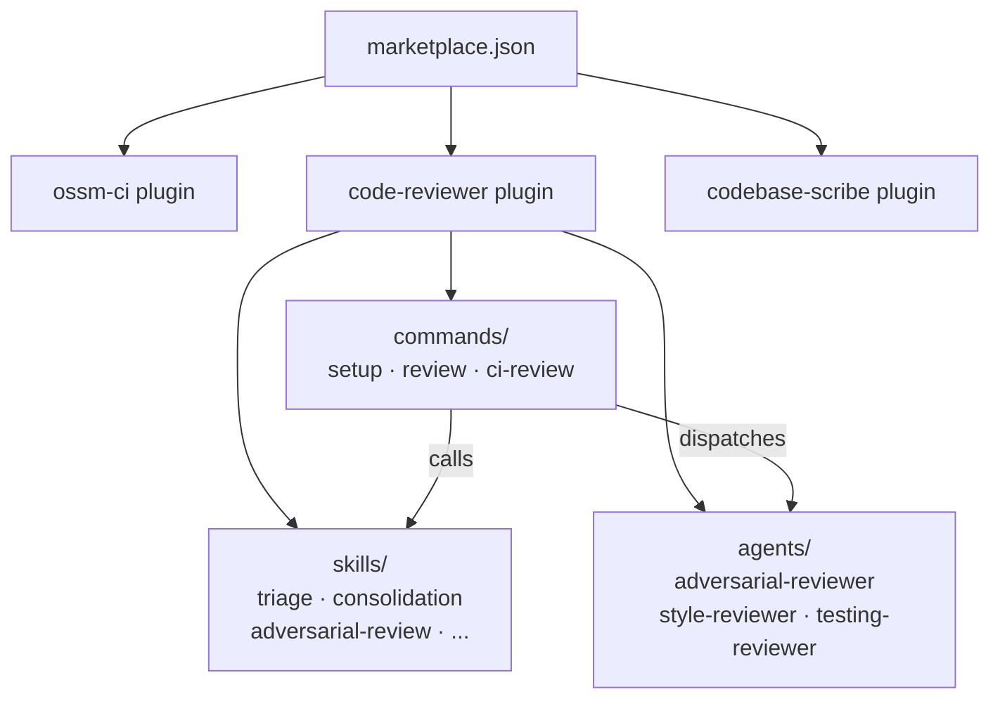

# Skills & AI Tooling

This repository is a **Claude Code skills marketplace** — a central place where the team publishes AI-powered utilities as installable plugins. Any project installs a plugin once and gets consistent slash commands across every developer's editor.

## Installation

```
/plugin marketplace add openshift-service-mesh/ci-utils
/plugin install code-reviewer@ci-utils      # repeat for ossm-ci, codebase-scribe
/reload-plugins
```

**Cursor:** `ln -s /path/to/ci-utils/plugins/code-reviewer ~/.cursor/plugins/local/code-reviewer`, then reload the window. Commands appear without namespace (e.g. `/review` instead of `/code-reviewer:review`).

## How the Pieces Fit Together



| Primitive | What it is | Runs in |
|---|---|---|
| **Plugin** | Installable bundle of commands + skills + agents | — |
| **Command** | The `/slash-command` entry point; orchestrates the workflow | Parent session |
| **Skill** | A reusable prompt step (`SKILL.md`) | Parent session |
| **Agent** | Subagent with isolated context, its own tools and model | Separate context |

## Available Plugins

| Plugin | Commands | Full reference |
|---|---|---|
| `ossm-ci` | `/ossm-ci:confidence` `/ossm-ci:generate-e2e-tests` `/ossm-ci:aws-scan` `/ossm-ci:prow-metrics` | [`plugins/ossm-ci/README.md`](../plugins/ossm-ci/README.md) |
| `code-reviewer` | `/code-reviewer:setup` `/code-reviewer:review` `/code-reviewer:ci-review` | [`plugins/code-reviewer/README.md`](../plugins/code-reviewer/README.md) |
| `codebase-scribe` | `/codebase-scribe` | [`plugins/codebase-scribe/README.md`](../plugins/codebase-scribe/README.md) |

## Why Central?

Agent definitions — personas, tool allowlists, model selection — travel with the plugin, not with each project. A fix committed here takes effect everywhere on the next `/reload-plugins`. Without this central repo, every project drifts toward its own ad-hoc prompts with no quality gate and no shared review.

→ [How to contribute a skill](contributing.md)
